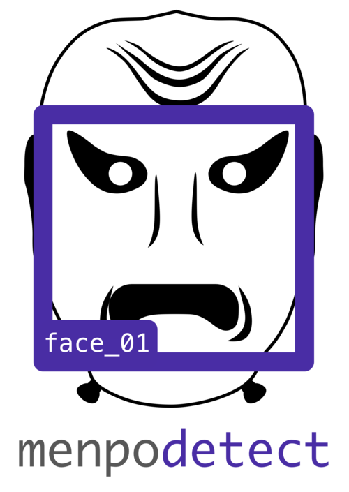

  

    
  
  
  
   
  
  
  

menpodetect - Simple object detection
=====================================
Simple object detection within the [Menpo Project](http://www.menpo.org/). We do not attempt
to implement novel techniques, but instead wrap existing projects so that they
integrate nicely with Menpo. At the moment the current libraries are wrapped:

  - **[dlib](http://dlib.net/) (Boost Software License - Version 1.0)**  
    Frontal face detection, arbitrary dlib models and training code is all
    wrapped.
  - **[opencv](http://opencv.org/) (BSD)**
    Frontal face detection, profile face detection, eye detection and arbitrary
    OpenCV cascade files (via loading from disk) are all provided.
  - **[pico](https://github.com/nenadmarkus/pico) (Academic Only)**
    Frontal face detection and arbitrary pico models are provided. Loading
    arbitrary Pico models is likely to be very difficult, however.
  - **[ffld2](http://charles.dubout.ch/en/index.html) (GNU AGPL)**
    Frontal face detection using the DPM Baseline model provided by
    [Mathias et. al.](http://markusmathias.bitbucket.org/2014_eccv_face_detection/).
    Training code is also wrapped, but requires explicit negative samples.
  - **[bob.ip.facedetect](https://pythonhosted.org/bob.ip.facedetect/) (GPL v3)**
    Frontal face detection based on the PhD thesis of Cosmin Atanasoaei of
    EPFL based on an ensemble of weak LBP classifiers. **Not currently shipped
    using conda and therefore must be installed independently.**

Important
---------
This project aims to wrap existing object detection libraries for easy
integration with Menpo. The core project is under a BSD license, but since
other projects are wrapped, they may not be compatible with this BSD license.
Therefore, we urge caution be taken when interacting with this library for
non-academic purposes.

Installation
------------
Here in the Menpo team, we are firm believers in making installation as simple
as possible. Unfortunately, we are a complex project that relies on satisfying
a number of complex 3rd party library dependencies. The default Python packing
environment does not make this an easy task. Therefore, we evangelise the use
of the conda ecosystem, provided by
[Anaconda](https://store.continuum.io/cshop/anaconda/). In order to make things
as simple as possible, we suggest that you use conda too! To try and persuade
you, go to the [Menpo website](http://www.menpo.io/installation/) to find
installation instructions for all major platforms.

If you want to try pip installing this package, note that you will need
to satisfy the dependencies as specified in the meta.yaml BEFORE install.

#### Build Status

|  CI Host |                       OS                  |                      Build Status                     |
|:--------:|:-----------------------------------------:|:-----------------------------------------------------:|
| Travis   | Ubuntu 12.04 (x64)                        | [![Travis Build Status][travis_shield]][travis]       |
| Jenkins  | OSX 10.10 (x64) and Windows 10 (x86, x64) | [![Jenkins Build Status][jenkins_shield]][jenkins]    |

[travis]: https://travis-ci.org/menpo/menpodetect
[travis_shield]: http://img.shields.io/travis/menpo/menpodetect.svg?style=flat
[jenkins]: http://jenkins.menpo.org/view/menpo/job/menpodetect
[jenkins_shield]: http://jenkins.menpo.org/buildStatus/icon?job=menpodetect

Documentation
-------------
See our documentation on [ReadTheDocs](http://menpodetect.readthedocs.org)
